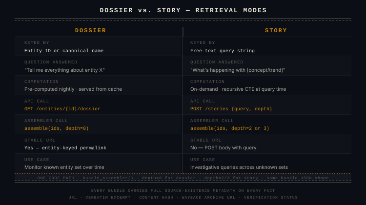

# Dossiers vs. Stories

A **dossier** answers *"tell me about X."* A **story** answers *"tell me what's going on with this idea."* Use a dossier when you know the entity; use a story when you have a question that spans entities.

**Full treatment pending.** See the specification for all worked examples:

- [Design Spec §2 — Dossiers vs. Stories](../superpowers/specs/2026-05-22-factvault-design.md#2-dossiers-vs-stories)

Topics this page will cover when written:
- The three dossier examples (VC associate, journalist, pharma analyst)
- The three story examples (CFO departures + SEC inquiries, acquisition chain, state AI legislation + PAC donors)
- The one assembler: `bundle_assembler(entity_ids, depth)` — same code path, different depth parameter
- When `depth=0` vs. `depth=2` vs. `depth=3` is the right choice
- How story entity seeding works (embedding similarity search, cosine > 0.6)
- The recursive CTE graph traversal and the confidence-gating of edges (≥ 0.4 to traverse)
- Dossier cache staleness (24-hour TTL, on-demand recompute via GET)
